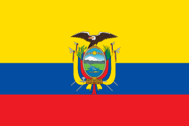

### Hi there 👋

Yooo! My name Adrian David Castro Tenemaya, and I am currently working as a full-time Data Engineer @ [Tacto GmbH](https://tacto.ai).
I come from the fantastic country of Ecuador , lived in Italy  for many years and now living in München, Germany .

### In a nutshell

- 🎓 B.S. in Computer Science @ Università degli studi di Milano-Bicocca
- 🎓 M.Sc. in Data Engineering and Analytics @ Technische Universität München
- 👷‍♂️ 5+ years of experience in software engineering
- 🍳 love to eat and to cook
- 🔗 LinkedIn: [Adrian David Castro Tenemaya](https://www.linkedin.com/in/adriandcastrot/)
- 🧑‍💻 Big fan of open source and active contributor to many projects
- 📃 You can find more about me and my CV on my personal website: [adct.it](https://adct.it)
